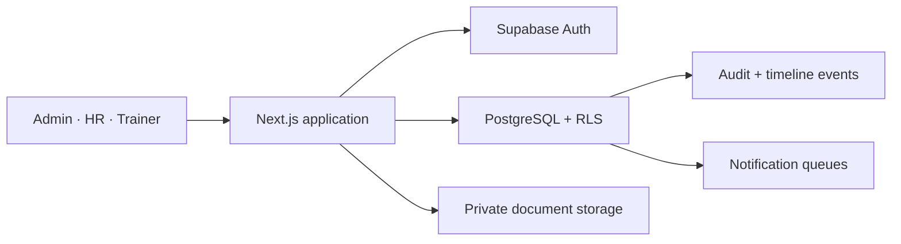

# Architecture

RASA SLMS uses a Next.js App Router application with TypeScript and Supabase for PostgreSQL, Auth and private object storage. Client components are limited to interactive operations; authorization remains in PostgreSQL RLS.

The application uses normalized enrollment-centred modules. Business values such as attendance thresholds and notification windows live in settings or versioned eligibility rules. Derived values—pending fees, overdue payments, overdue projects and eligibility—are computed from source records rather than manually edited status fields.

The application contains no demo student workspace. Without Supabase it shows a setup state; an explicitly enabled development-only loopback mode can review the ignored workbook extraction without making it deployable. Production reads and mutations use the Supabase clients in `lib/supabase`, transactional database functions, and the policies in the committed migrations.
