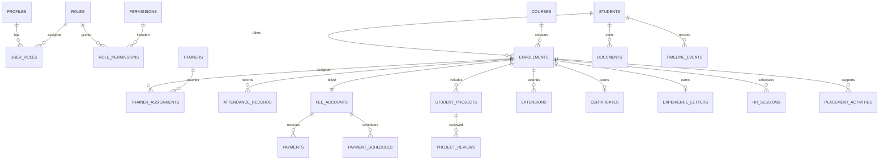

# Database schema

UUIDs are used for operational entities; money uses `numeric(12,2)` and timestamps use `timestamptz`. Historical course name, code and fee are snapshotted on enrollment. Payments are posted or voided, never normally deleted. Student codes are allocated with a row-locked annual sequence rather than `COUNT(*) + 1`.

Spayee passwords are intentionally absent. If credential custody becomes mandatory, it requires a separately approved encrypted server-only design with dedicated access auditing.

